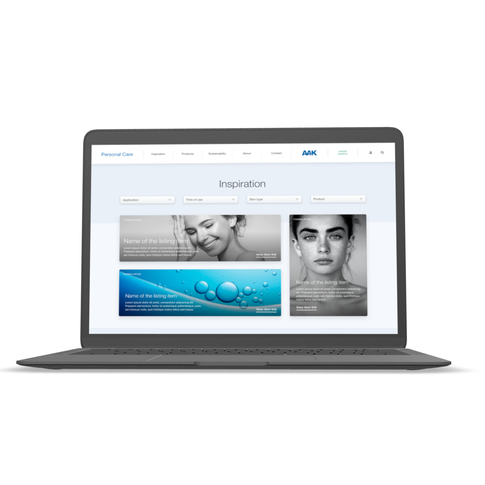
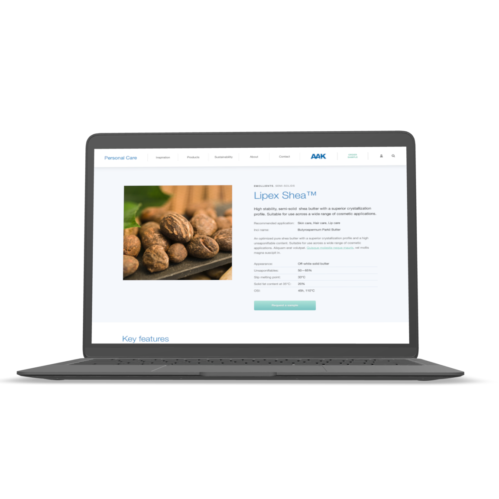
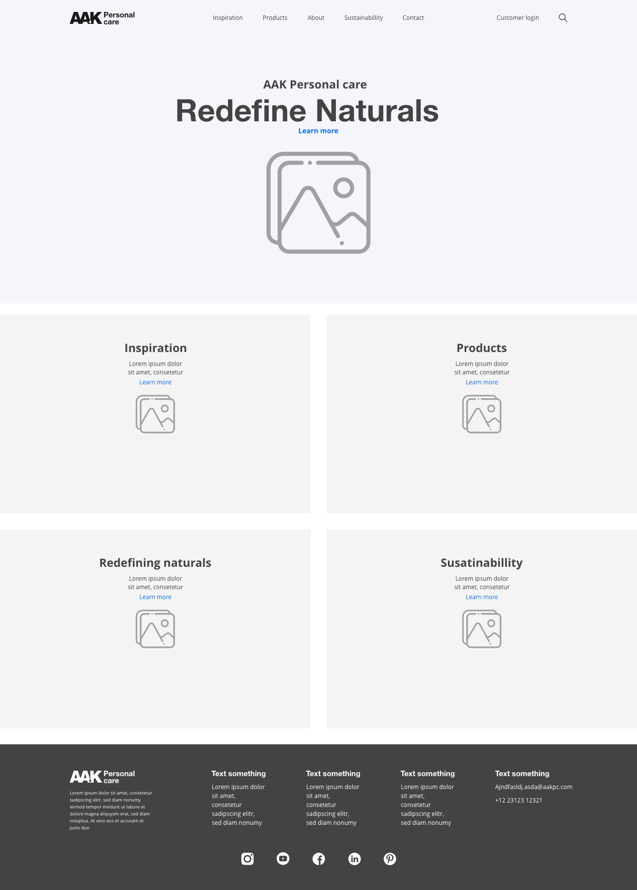
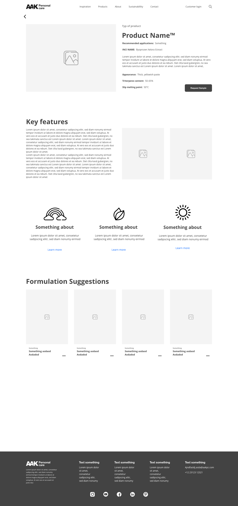
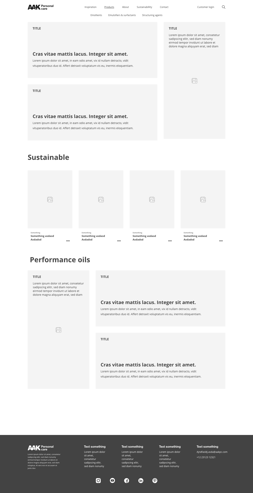

# Taking care of personal

AAK personal care (APC) is a subsidiary of the AAK brand. APC wanted to reframe their entire communication strategy and refocusing their main user group. Formalists are the new key target group for AAK products which are used in the development of cosmetic applications. 

I was brought on board as the lead UX strategist where I helped build the initial business case internally and guiding the design process from the start. I worked on re-framing the existing communication strategy and building the APC service blueprint. 
I also worked on mapping the user journey and designing the new user flow with multiple new digital touchpoints.

The client and organisation were very digitally immature but were well aware of their limitations. This made for a great constructive collaboration where the process became straightforward as they relied on my expertise but the client was very willing to learn and transform the organisation. This meant that they could challenge the processes and contribute their expertise and organisational needs which made each step very productive where I gained as many insights as a gave. 

What I especially enjoyed working with APC was their willingness to take their time and not rushing things due to budget constraints. They gave us the possibility to educate about each step and display the intended impact before moving to the next step. This meant that were to give room to also evaluate each step which also meant we could adjust the overall strategy accordingly to our findings and maximizing our outcomes.   

