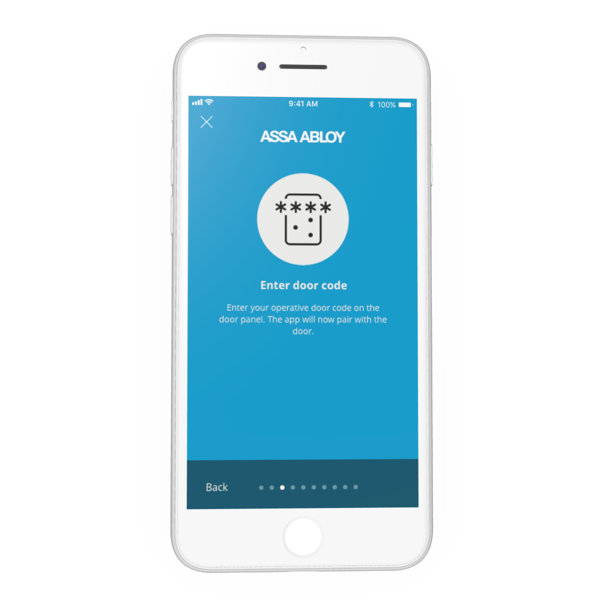
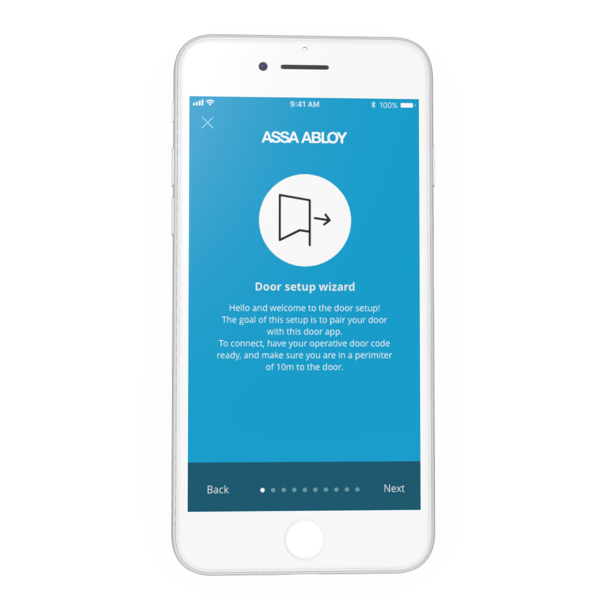
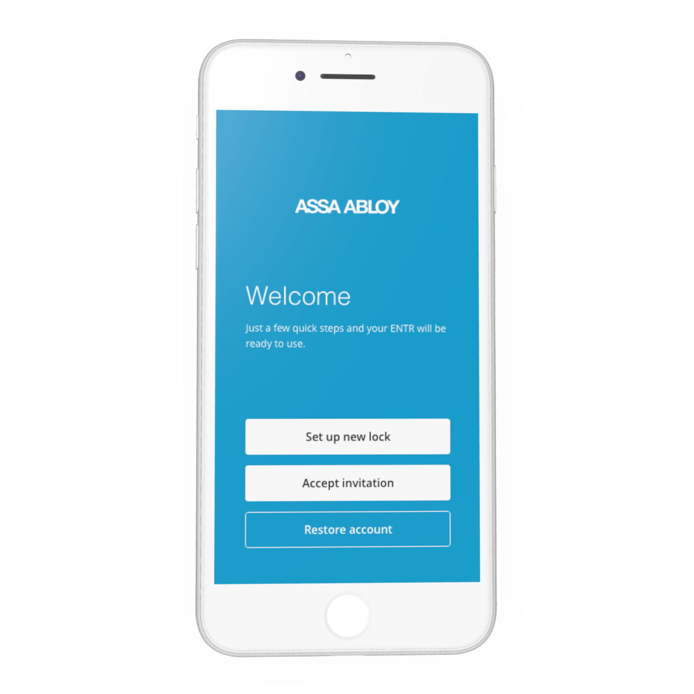
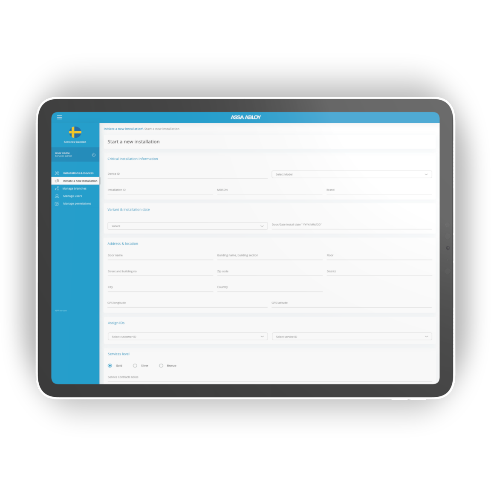
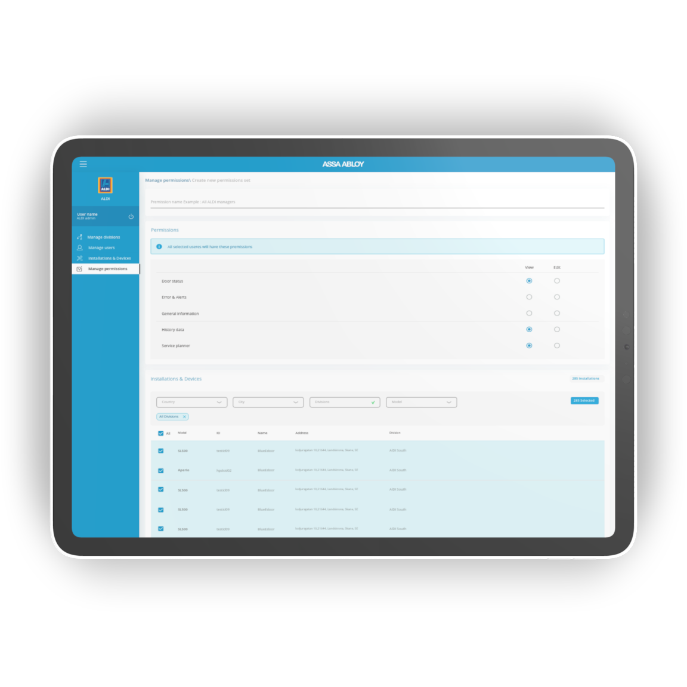
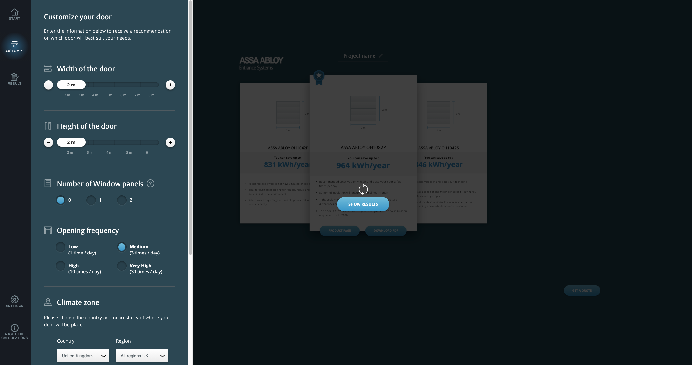
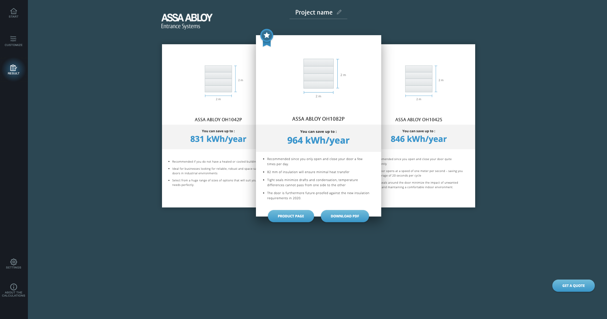

# Digital door solutions

Assa Abloy is a global door opening solutions provider. I have worked together with Assa Abloy on two occasions. Frist as lead designer for two of their mobile applications. One was aimed at consumers replacing the physical on door interface with an app interface instead. I was responsible for setting up the user flow, app design and any new design assets needed for the product. This work was done in close collaboration with the Assa Abloy global design division where I was apart of the initial stages of setting up the Assa Abloy design system. 
The second application was a service tool for door technical providing them with a tool for setting up and servicing their connected doors. Again I acted as a lead designer throughout the development of the product until launch where designs and flows where pipelined back to the global design department. The design included both IOS and android for both mobile and tablet use of each application. 

# Sales tools 

The second occasion I worked with Assa Abloy was with the design of is called the "Door calculator". The calculator was developed as a sales tool but was later reassessed and the decision was made to adapt it for web use. I consulted on the design strategy setting up data aggregations point and adapted the original design and functionality for browser use.  

