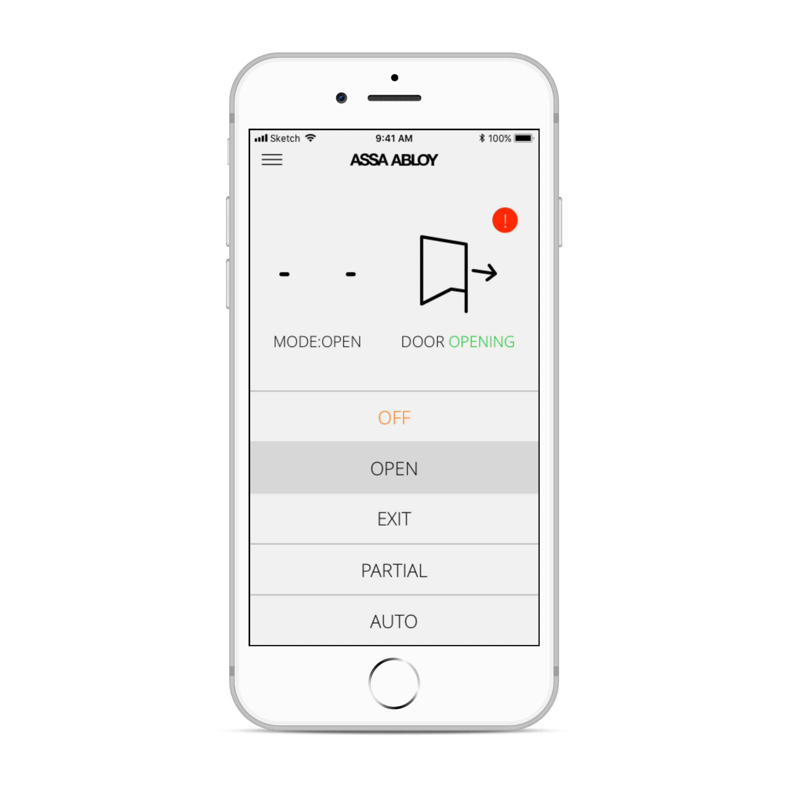

# Sensing data 

Cedes develops intelligent sensors solutions. I was brought on to help the design visualisation and configuration tool for their object recognition sensor TOF/Start. The goal was to visualize what the sensor "sees" but also enable technicians with an interface to define objects and set up programming rules. The work also included the design of the interface for sensory data and functionality for calibration and servicing the sensor. 
The design was solely made for Android tablet use.     

