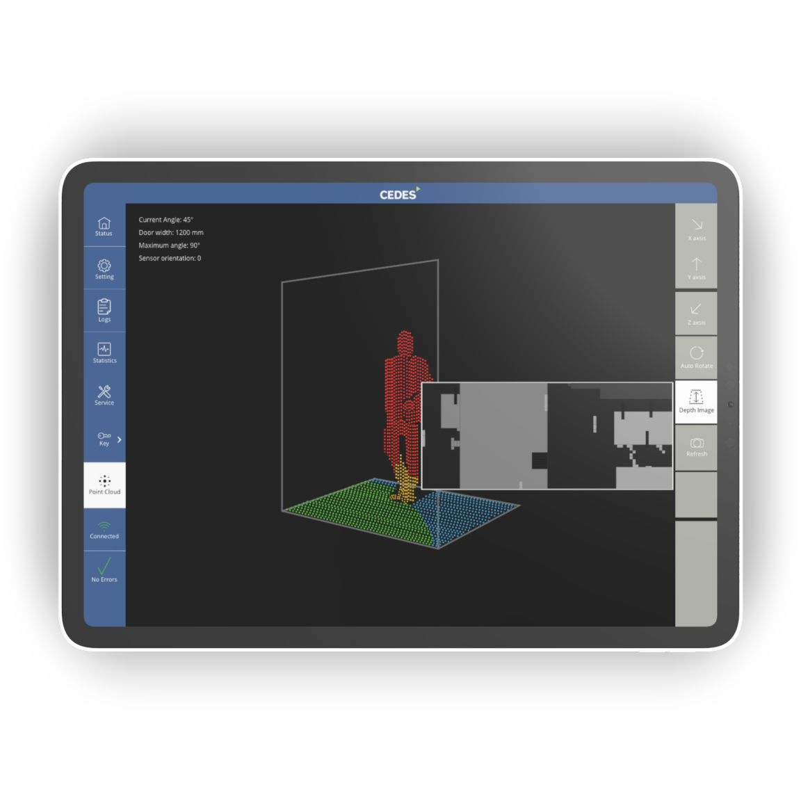
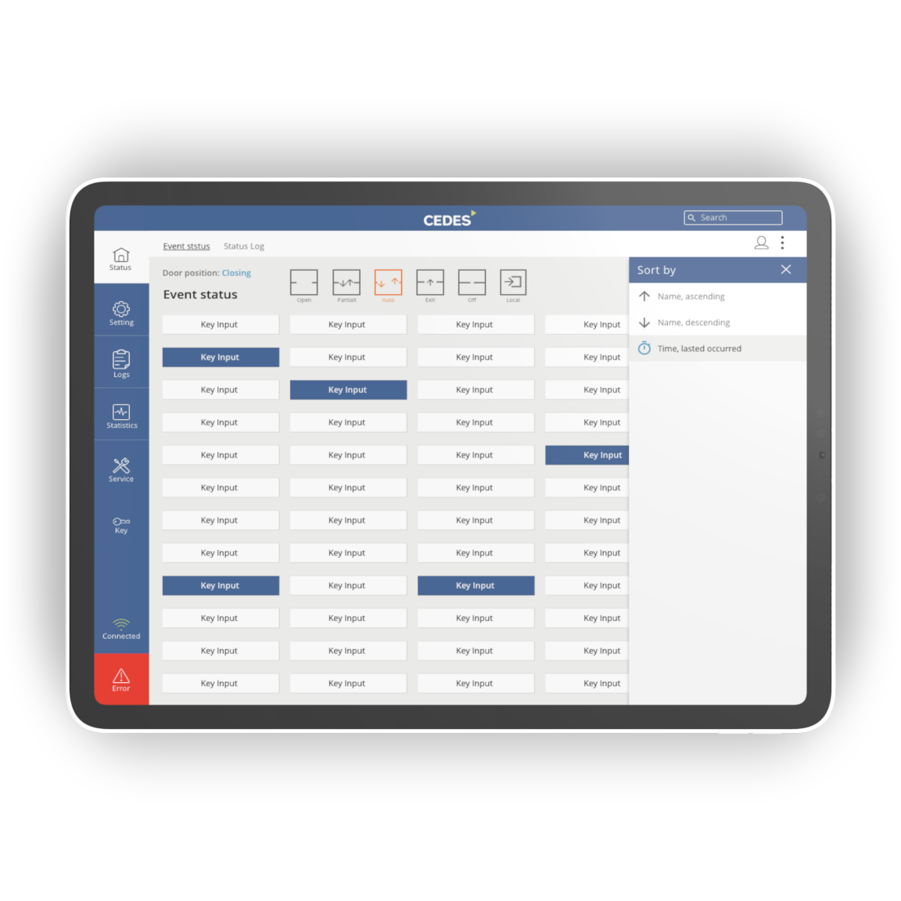
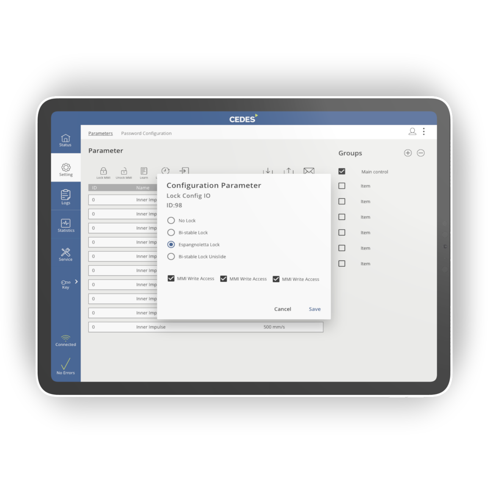
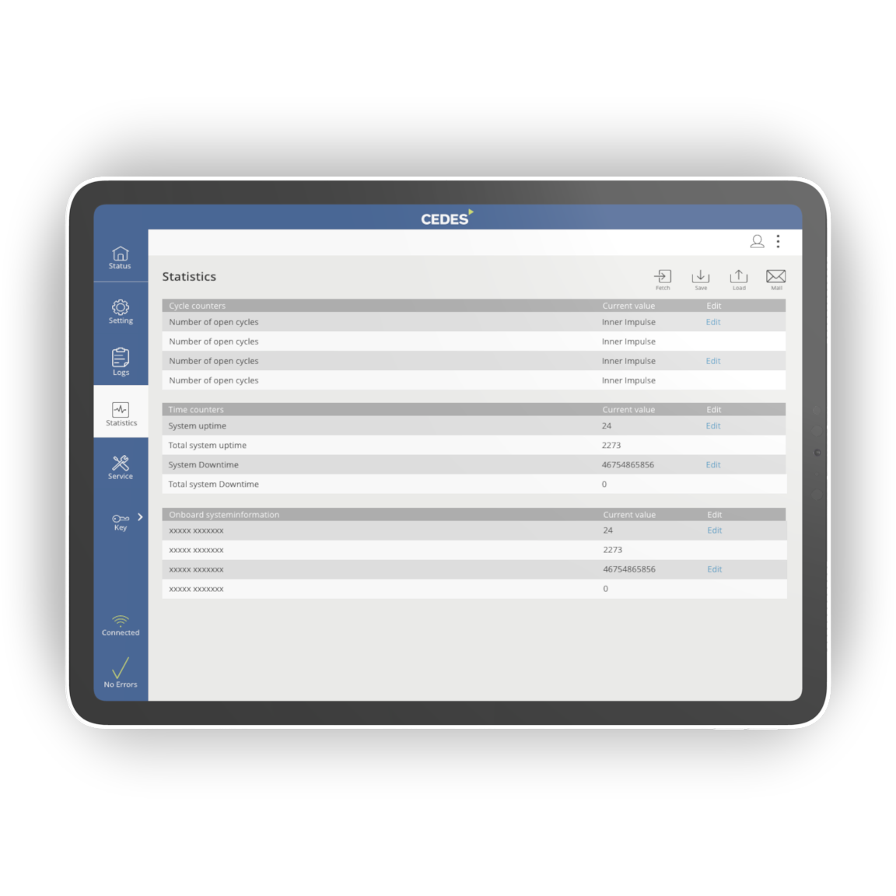

# Sensing data 

Cedes develops intelligent sensors solutions. I was brought on to help the design visualisation and configuration tool for their object recognition sensor TOF/Start. The goal was to visualize what the sensor "sees" but also enable technicians with an interface to define objects and set up programming rules. The work also included the design of the interface for sensory data and functionality for calibration and servicing the sensor. 
The design was solely made for Android tablet use.     

One of the interesting aspects of working on this project was to provide the project owner with a vision for the product which he could use to build the business case internally. As the sensor was not a typical camera which outputs imagery it was hard envisioning what type of visualization we could provide. The output from the sensor was basically multiple arrays of coordinates where we worked closely with the developers to define what output data might be relevant to visualize. In a sense, would have been easier to develop the visualization in code rather than designing it. With some simple sketching, we convinced the client that we need to push up the fidelity to truly be able to show the product which we also were allowed to do. In the end, we were able to prove the benefits of putting in the extra effort in the design phase before moving into full development as the prototype contributed to som big insights which lead to the client reassessing and changing some of the features for final implementation. 

