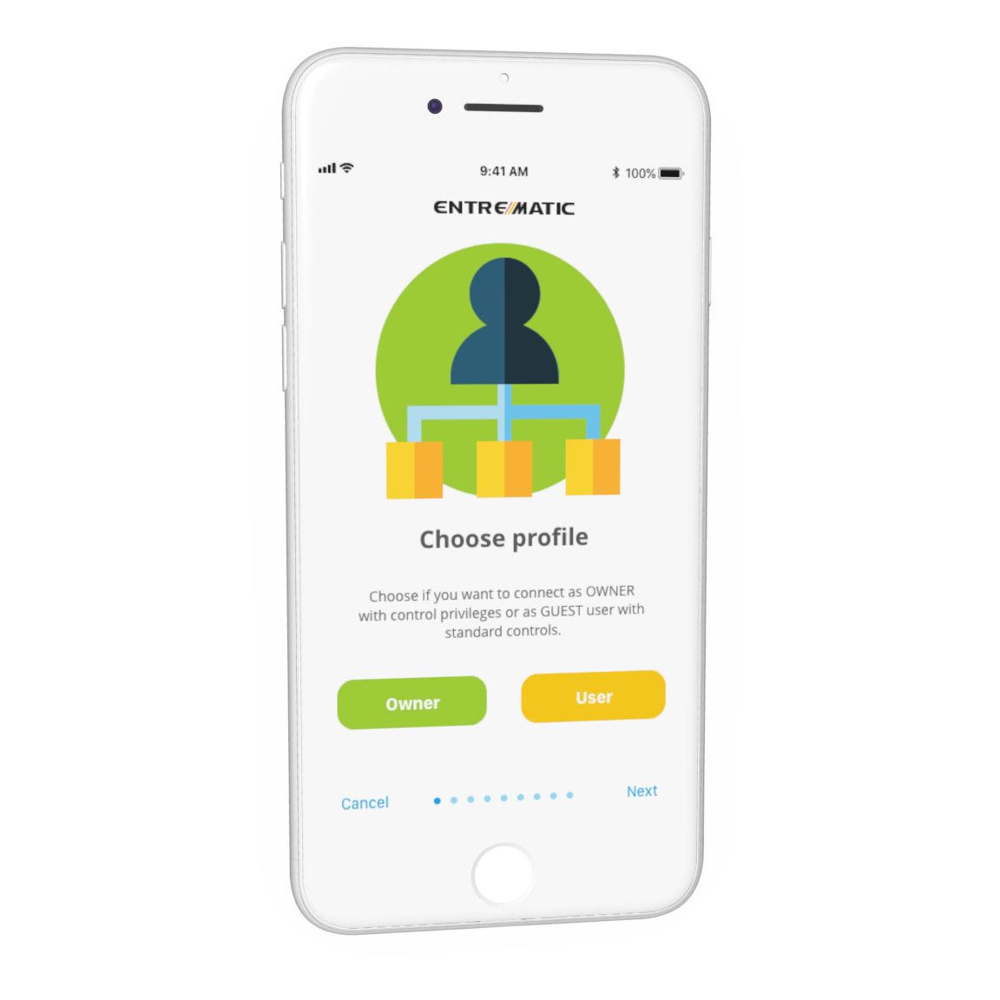
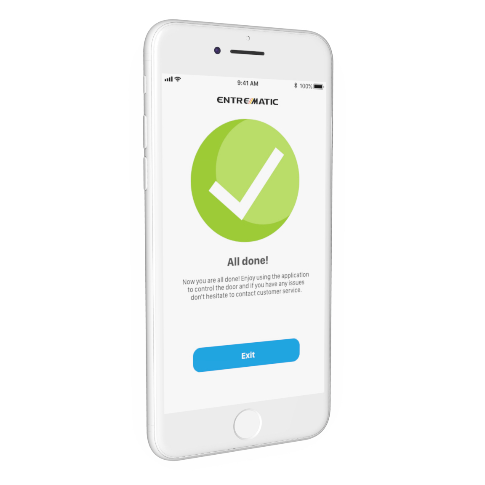
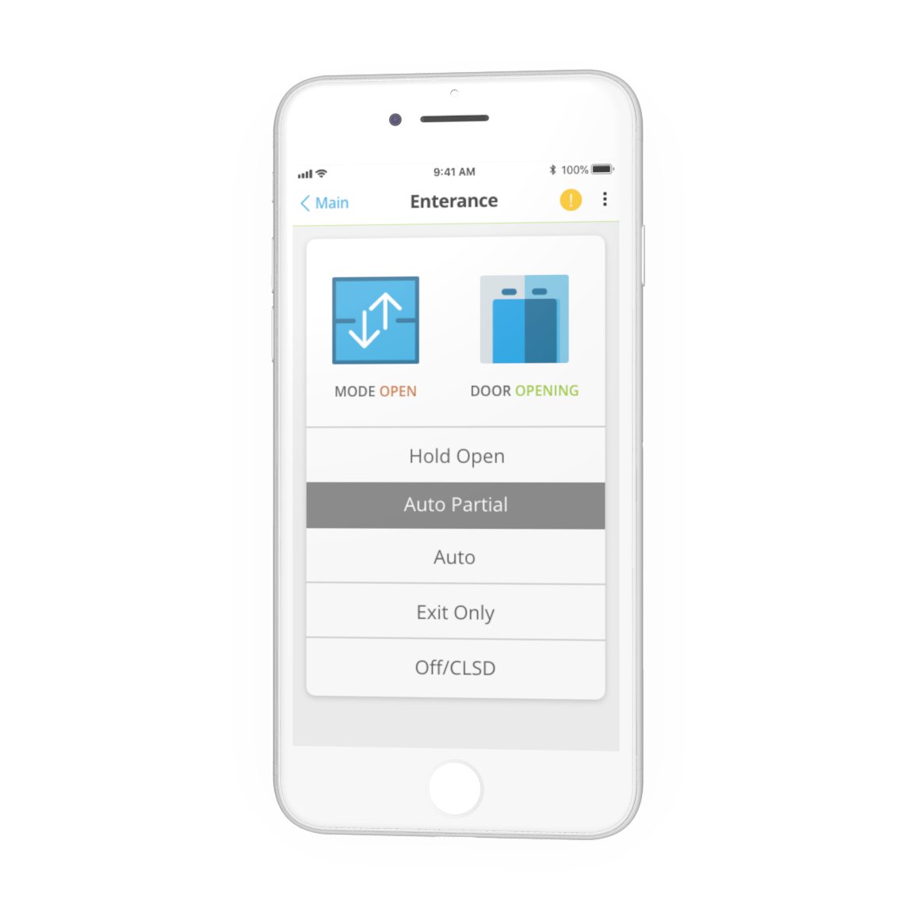
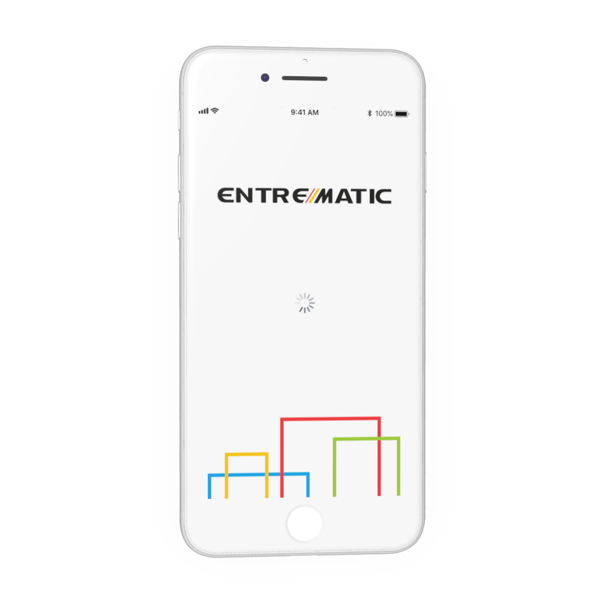
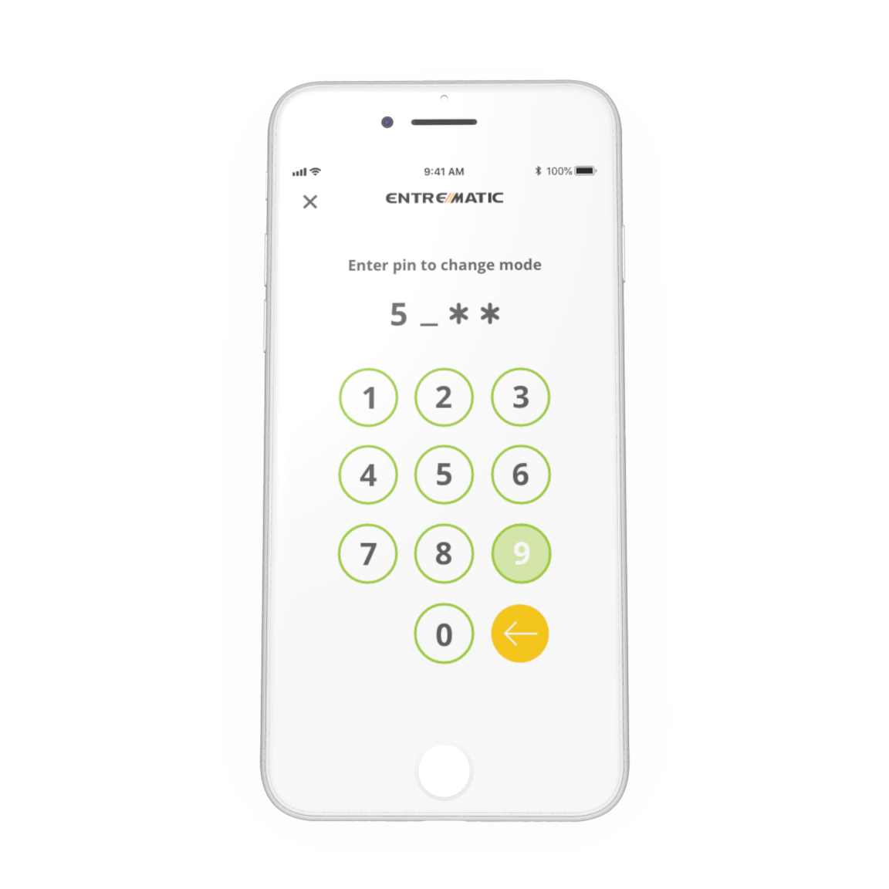

# Door affordance 

Entermatic is a global brand within the intelligent door opening solution.  was hired to design a user-friendly mobile app for controlling door solutions in their retail segment. Entermatic lack any formal brand guidelines where I also worked on building this for digital product development. I worked as the sole designer on the development, working from the very start with setting up the design strategy and user flows to the production design during development. 
This was Entermatics first publication of a digital product where I also consulted on the communication and setup for digital distribution through the Google and Apple stores.  

One of the most enjoyable aspects of working with Entermatic was that even though they were not a primarily design-driven company I was given a lot of freedom to explore how we could increase the user experience. We put a lot of work into the fidelity of the design introducing and exploring micro animation for improving the understanding of the product. Exploring SVG animation was a joy as this was done in close collaboration between the client, design and development as standards for how to do it was lacking at the time and required a good understanding of the technical aspects of visual elements and code from both the developers and designers.     

