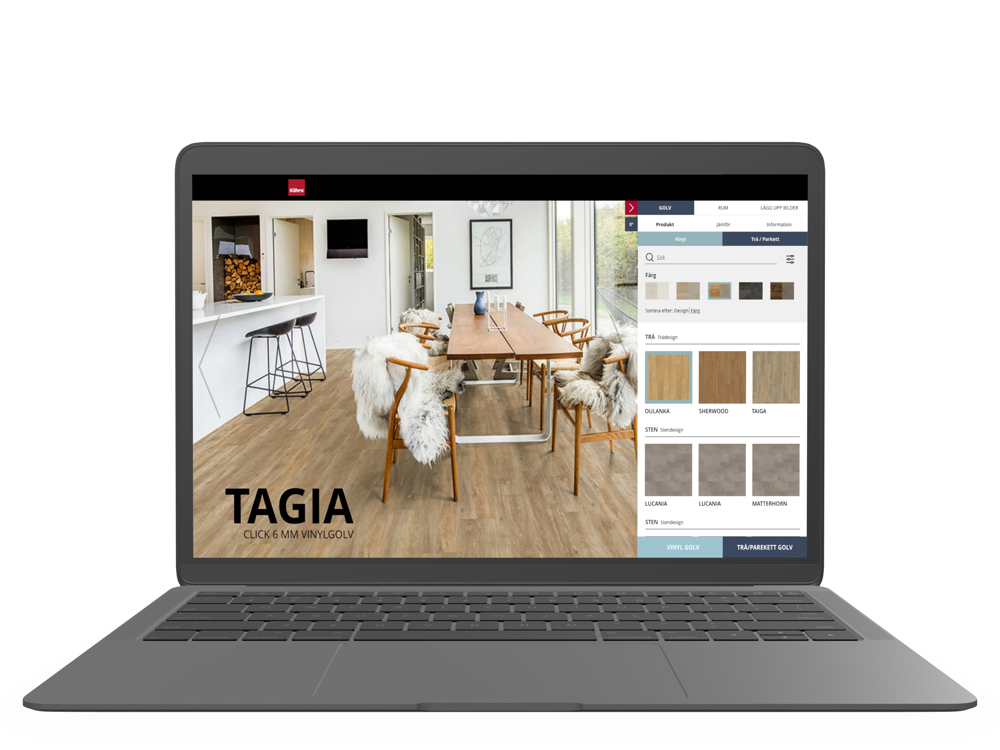
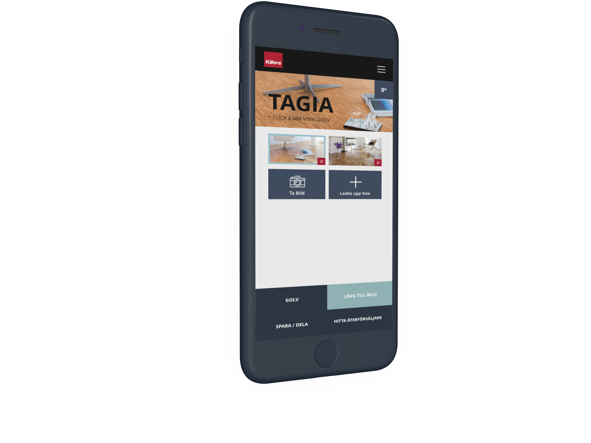
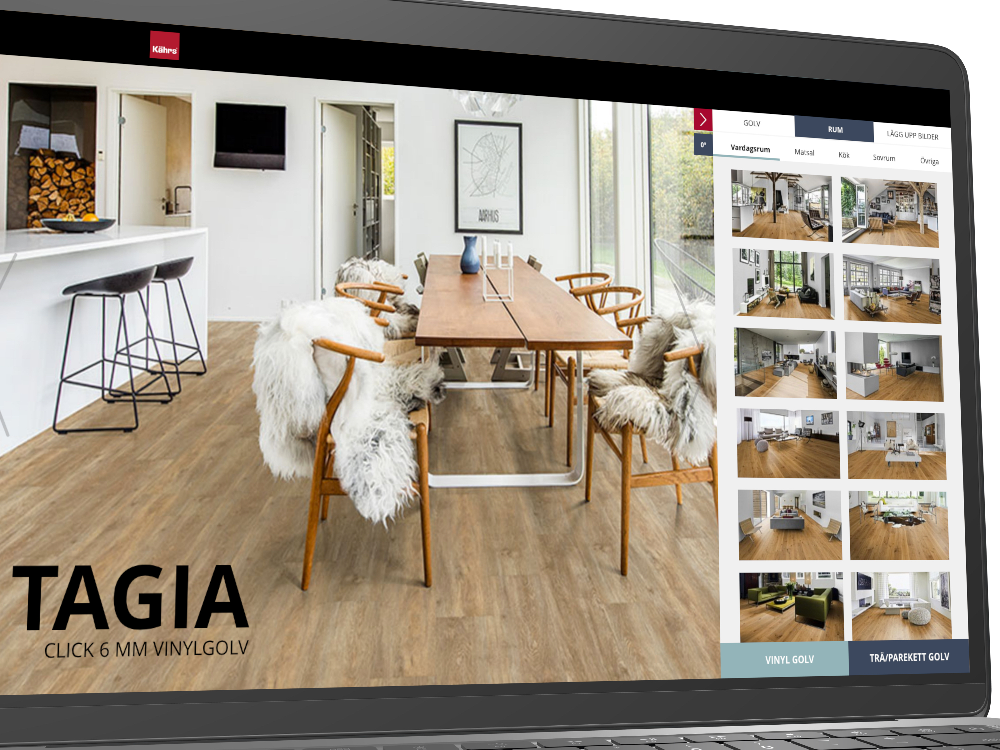
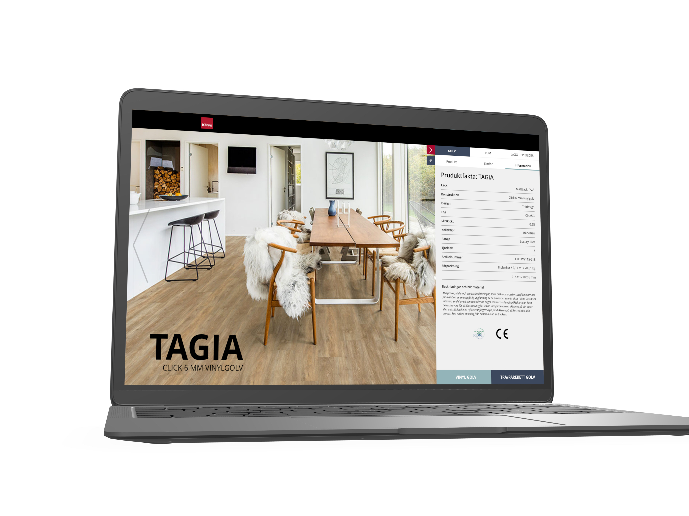
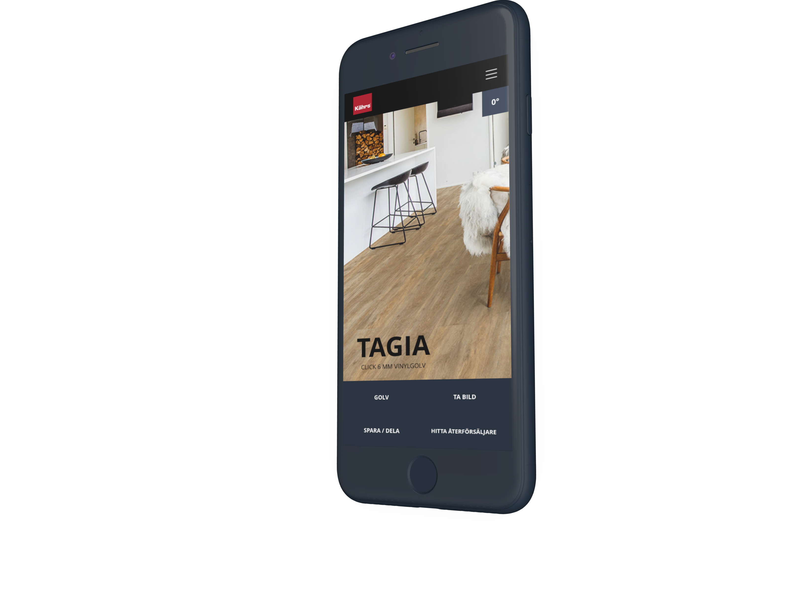

# The digital journey 

Khärs is a premium flooring solution company based in the Nordics. I was invited to help Khärs set up a strategy and roadmap for their entire digitalization process. I developed a framework dubbed "Lighthouse" to help them evaluate and build business cases for all ongoing digital initiatives and to define a starting point. I also worked on work method strategies in the digitalization of the company and how to move into agile workflows while building up internal digital competencies gradually. 

With our strategy, we aimed to present a holistic perspective on digital markets and the digital transformation Kährs is facing. The frame we set during the start of our work was is that the building market in general at a global scale has been slow to adapt to digitization processes whereas studies have shown that this industry has to most to gain from becoming digital. However, this opened up the opportunity for Kährs to take the role as a digital leader within the flooring solutions market and dictate it according to your needs and become a guiding company in the industry. 

For Khärs I have also worked on digital innovation initiatives building a new online floor planning solution with a strategy on how to better integrate and set requirements for their 3ed party solutions providers.  

This work was done with the upcoming design system in mind. As part of the strategic work, I had done with the client it had become clear that the organisation needed to prepare itself for moving into becoming a digital product company. For me, a design system provides a solid foundation not only to produce digital products but also acts as an anchor for the collective design vision of a company. As the client was new to the concept, we also wanted the work with the floorplanning tool to display the potential of having a design system in place and what would be its impact the organisation and upcoming digital initiatives.              

