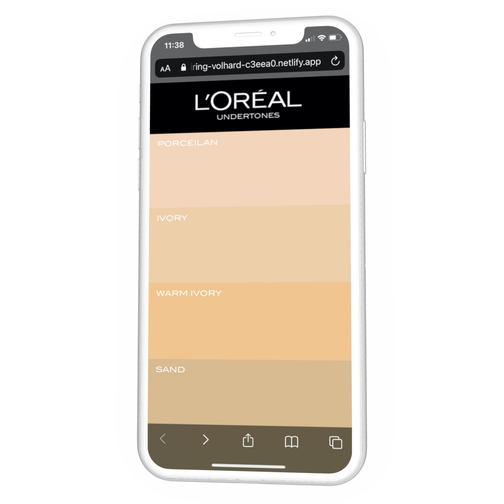
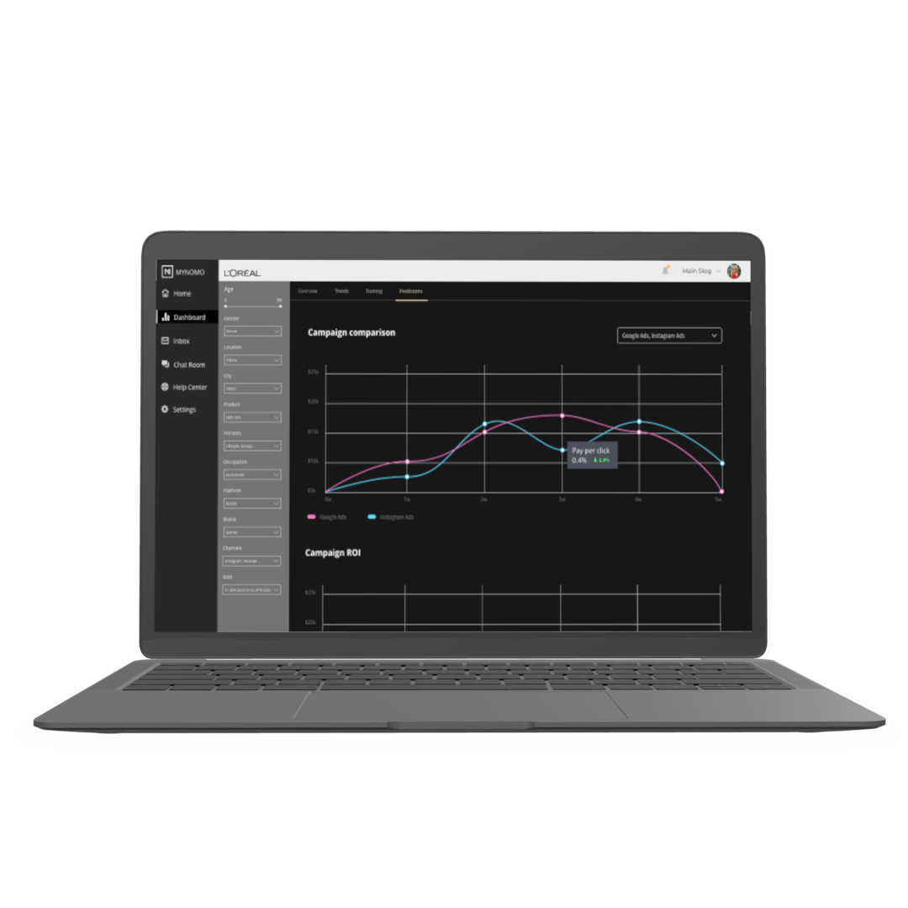

# Online to offline

I worked with Loreal on multiple occasions mainly on providing them with innovation concepts. Foremost within the area of offline to online marketing and how to use available technologies for bridging this gap and providing new digital touch and data points. 

Loreal undertones were one of the concepts I developed on the topic of QR codes as a simple interactive in-store product guide. The  QR code redirects the user to a website with colour swatches for different skin tones which can easily be placed next to the arm if displayed on a mobile device. The swatch is linked to Loreals product selection suitable for that type of skin tone.

## Data insights 

I have also consulted on their customer data aggregation and insights development. Concerning this, I also developed the concept for their internal business intelligence tool and how data can be expanded upon with expert insights creating a mixed system of quantifiable and qualitative data.        

