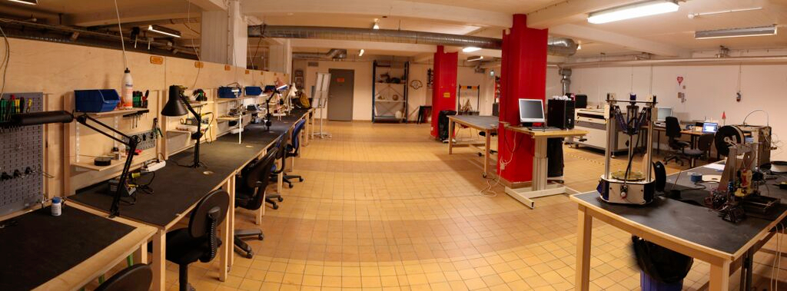
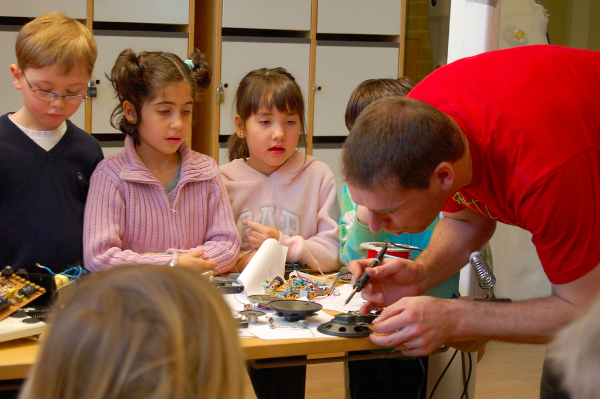
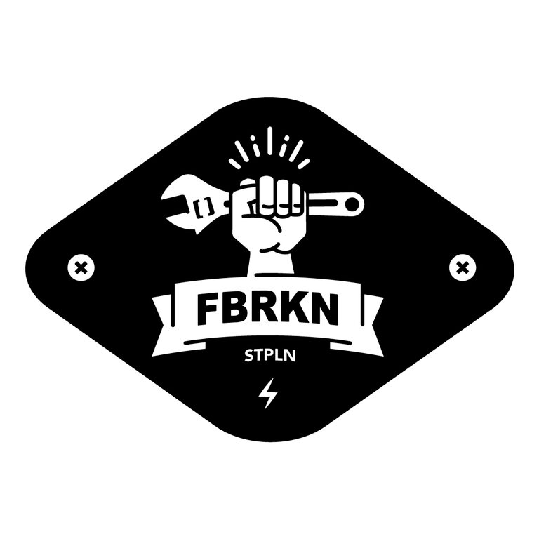

### Picasso had his pink period and his blue period. I am in my blonde period right now.

When I first started wearing pink, it wasn't nothing I planned on doing or strategized. But people showed me so much love for the pink mink I wore, I had to go out to Pantone and create my own color, which is called Killa Pink.

<iframe width="560" height="315" src="https://www.youtube.com/embed/70OzVfBxZFE" frameborder="0" allow="accelerometer; autoplay; clipboard-write; encrypted-media; gyroscope; picture-in-picture" allowfullscreen></iframe>

<iframe title="vimeo-player" src="https://player.vimeo.com/video/17182656" width="640" height="360" frameborder="0" allowfullscreen></iframe>

<iframe src="https://player.vimeo.com/video/86010878" width="640" height="360" frameborder="0" allow="autoplay; fullscreen" allowfullscreen></iframe>

<a href="https://vimeo.com/86010878">STPLN Window Project - Tony Olsson</a> from <a href="https://vimeo.com/stpln">STPLN</a> on <a href="https://vimeo.com">Vimeo</a>.

<iframe src="https://player.vimeo.com/video/5216209" width="640" height="368" frameborder="0" allow="autoplay; fullscreen" allowfullscreen></iframe>

<a href="https://vimeo.com/5216209">David the synth</a> from <a href="https://vimeo.com/user720986">tony olsson</a> on <a href="https://vimeo.com">Vimeo</a>.
