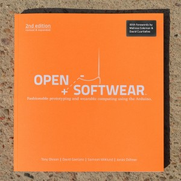
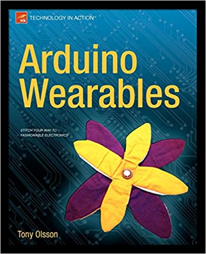
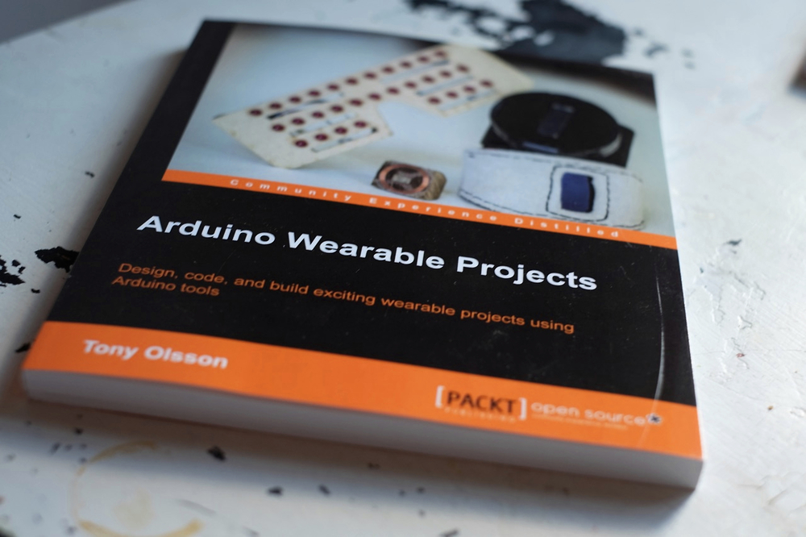

# Beyoned the body

Since 2007 I have been a part of an artistic research group looking into the wearables and more specifically tele-haptic devices.
The work done has mainly be based on the artistic visions of Norwegian Artist Ståle Stenslie.
Since the early 90s Stenslie has been investigating how to connect human bodies through the use of technology.
The research I have done in this project has focused upon the design of interaction with the technology as well as the design and construction of the same.
Through the years we have developed a large range of tele haptic garments used in multiple context and exhibitions. 
My research and work in wearables have also spun off their multiple academic publications and three books on the topic of learning to design and prototype using technology.  

## Psychoplastics
The Psychoplastics (2010) project explores how our personality can be sculpted and manipulated for real. How can an immersive and corporal experience change and manipulate our feelings? How does it to feel to become someone else? From the inside?

The exhibition turns the body into the stage of a sensorial theater. The users are dressed in electronic, computer-controlled bodysuits. The bodysuit becomes the new skin of the user, slipping him or her into the corpus of a story told through touch and binaural, 3 dimensional sound. The suit imprints stories about corporal ecstasy. The touch based bodysuit renders the stories physical. So the experience becomes a real, personal and intimate play with ones’ own body and identity.

Interaction is simply done by walking around either inside the gallery (version one) or outside (version two) in public space. Here the immaterial experiences are placed in the open through GPS based navigation. The project so transforms public space into sensual, transformable and invisible structures. The bodysuit acts here as a skin of sensations, letting the user sense empty space filled with sensations.

Turning the body of the user into the stage of an internal and psychological drama challenges established notions of what a work of art can be.

## The Blind Theater
The Blind Theater turns the body into the stage of a sensorial theater. The piece plays with the body as the central stage of a different theatrical experience.
Upon entering the theater, the visitor is met by a personal guide. This guide follows the user through the whole play, a half hour long dive into a different sensorial reality. For the first time, the blind gain full access to the theater and –on the other side- the sighted gets the sensation of the blinded.

## Stitchies

Human Stitchies is a playful performance built both on the autoerotic exploration of one’s own body in combination with the shared experience of exchanged, tactile imprints.

The performance connects two participants over a telehaptic network. For an on site presentation during Remote Encounters we suggest placing two users in separate rooms and without direct visual contact. Each participant will wear a wireless, custom made bodysuit controlled by a smartphone. The suit enables the participants to exchange voice, sound and touch over the network, forming a telehaptic play experimenting with an expanded, social and shared form of embodiment. The system so to speak stitches its participants together in an immersive, extended and haptic space.

The system is based on our latest open-source, Arduino based and wireless system. Each bodysuit has a full-body resolution of 120 haptic zones. Every zone includes one tactor (tactile output) in combination with a touch sensitive input (sensor). When touching their own body each participant sends the corresponding body image to the remote user. The telehaptic communication is further extended by adding a haptic vocabulary that triggers when users touches themselves in certain configurations. This vocabulary consists of a library of pre-edited haptic patterns. A voice channel is included to facilitate for immediate feedback and communication.

<iframe width="560" height="315" src="https://www.youtube.com/embed/rRPb8B16QD0" frameborder="0" allow="accelerometer; autoplay; clipboard-write; encrypted-media; gyroscope; picture-in-picture" allowfullscreen></iframe>

## Open Software 
Open Softwear is a book about fashion and technology. More precisely it is a book about Arduino boards, conductive fabric, resistive thread, soft buttons, LEDs, and some other things. We started researching five years ago thanks to the support of K3,  School of Arts and Communication, Malmö University, Sweden.

Authors T. Olsson, D. Gaetano, J. Odhner, and S. Wiklund got the chance to come together to write down their conclusions in the form of an illustrated book aiming at students and professionals trying to enter the field of physical computing from the softwear perspective.

Open Softwear is a book for beginners looking into wearable computing or into fashion and technology. Its 104 pages are an opening for courses and workshops in the field. The original document was downloaded over 14.000 times from this website what brought us to make a revised edition in print.

## Arduino Wearables
Arduino Wearables is the complete guide to getting started with Arduino and wearable computing. The 10 inspiring projects to make, learn from, and build upon will equip you for creating your own projects; the only limit is your imagination.

You've probably seen LED-decorated t-shirts and hats, and maybe even other electronic gadgets embedded in clothing, but with Arduino Wearables you can learn to make your own wearable electronic creations.
This book is an introduction to wearable computing, prototyping, and smart materials using the Arduino platform. Every chapter takes you all the way from idea to finished project. Even if you have no experience with Arduino, this book will get you set up with all the materials, software, and hardware you need; you'll complete simple projects first, and then build on your growing expertise to make more complex projects. By the end of the book, you'll have learned:

<iframe width="560" height="315" src="https://www.youtube.com/embed/0lhQfzEYx0w" frameborder="0" allow="accelerometer; autoplay; clipboard-write; encrypted-media; gyroscope; picture-in-picture" allowfullscreen></iframe>

## Arduino Wearable projects
The demand for smart wearable technologies is becoming more popular day by day. The Arduino platform was developed keeping wearables, such as watches that track your location or shoes that count the miles you've run, in mind. It is basically an open-source physical computing platform based on a simple microcontroller board and a development environment in which you create the software for the board. If you're interested in designing and creating your own wearables, this is an excellent platform for you.

This book provides you with the skills and understanding to create your own wearable projects. The book covers different prototyping boards which are compatible with the Arduino platform and are suitable for creating wearable projects. Each chapter of the book covers a project in which knowledge and skills are introduced gradually, making the book suitable for all kinds of readers.

You begin your journey with understanding electronic components, including LEDs and sensors, to get yourself up to scratch and comfortable with different components. You will then gain hands-on experience by creating your very first wearable project, a pair of interactive bike gloves that help you cycle at night. This is followed by a project making your own funky LED glasses and a cool GPS watch. You'll also delve into other projects including creating your own keyless doorlock, wearable NFC tags, a fitness-tracking device, and a WiFi-enabled spark board. The final project is a compilation of the previous concepts used where you make your own smart watch with fitness tracking, internet-based notifications, GPS, and of course time telling.

