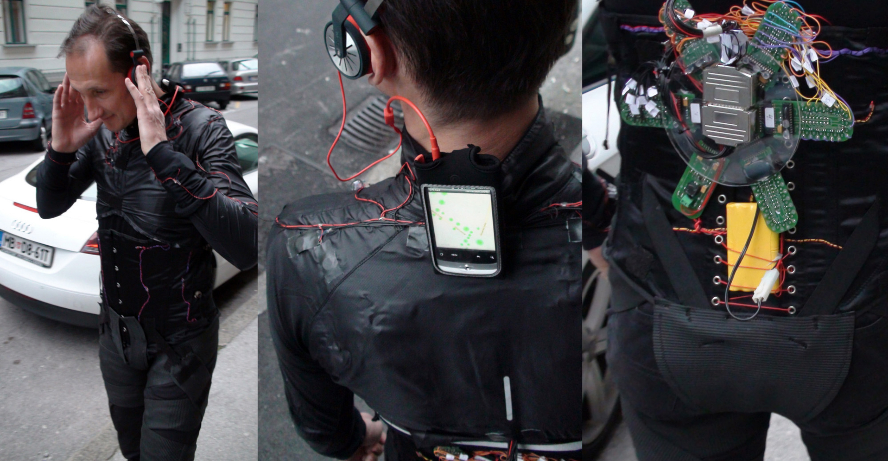
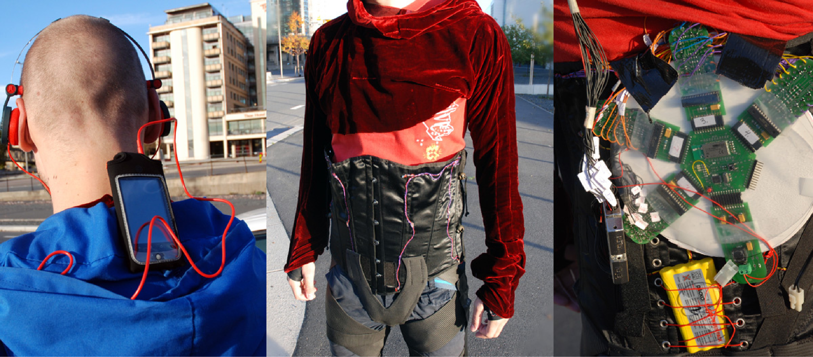
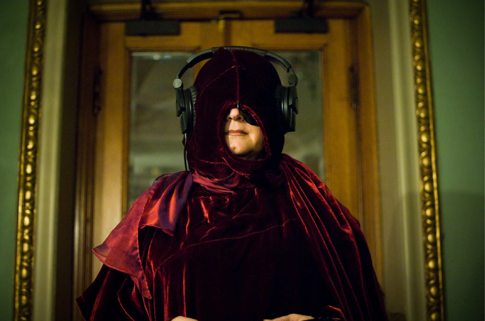
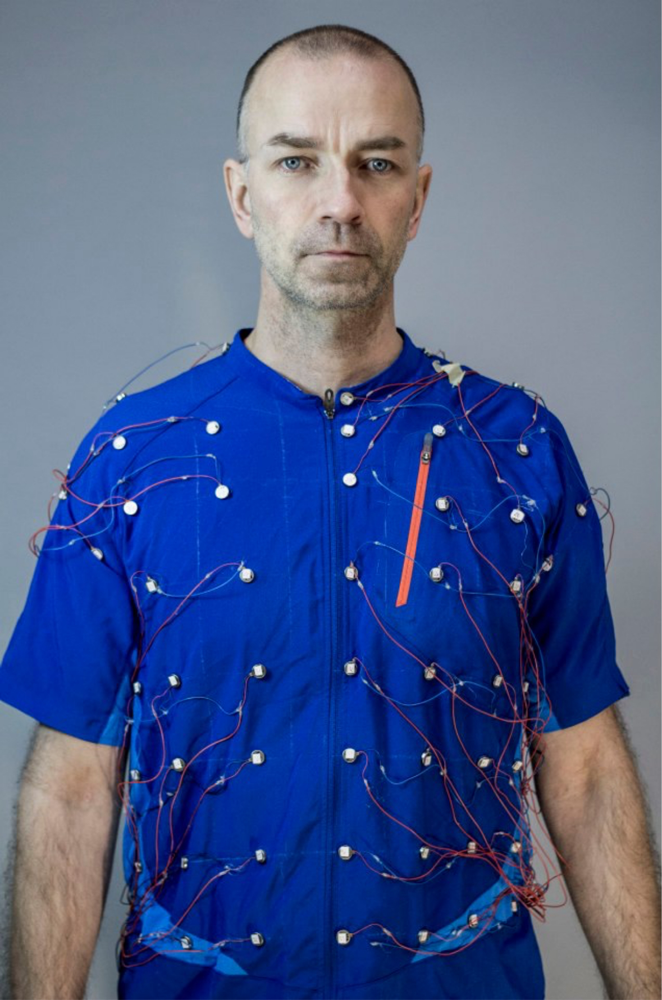
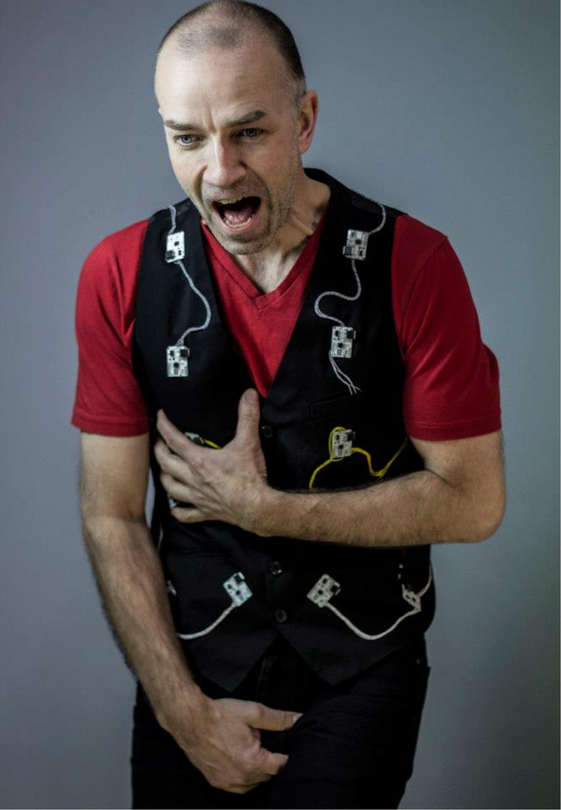

# Beyoned the body

Since 2007 I have been a part of an artistic research group looking into the wearables and more specifically tele-haptic devices.
The work done has mainly be based on the artistic visions of Norwegian Artist Ståle Stenslie.
Since the early 90s Stenslie has been investigating how to connect human bodies through the use of technology.
The research I have done in this project has focused upon the design of interaction with the technology as well as the design and construction of the same.
Through the years we have developed a large range of tele haptic garments used in multiple context and exhibitions. 
My research and work in wearables have also spun off their multiple academic publications and three books on the topic of learning to design and prototype using technology.  

<iframe width="560" height="315" src="https://www.youtube.com/embed/rRPb8B16QD0" frameborder="0" allow="accelerometer; autoplay; clipboard-write; encrypted-media; gyroscope; picture-in-picture" allowfullscreen></iframe>

<iframe width="560" height="315" src="https://www.youtube.com/embed/0lhQfzEYx0w" frameborder="0" allow="accelerometer; autoplay; clipboard-write; encrypted-media; gyroscope; picture-in-picture" allowfullscreen></iframe>

