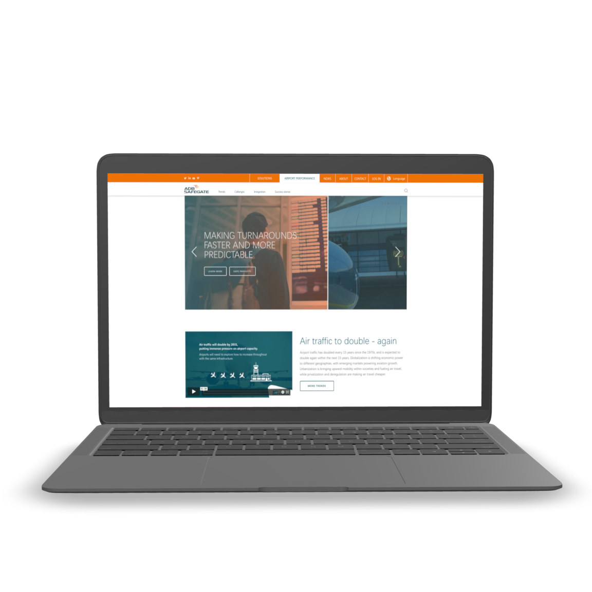
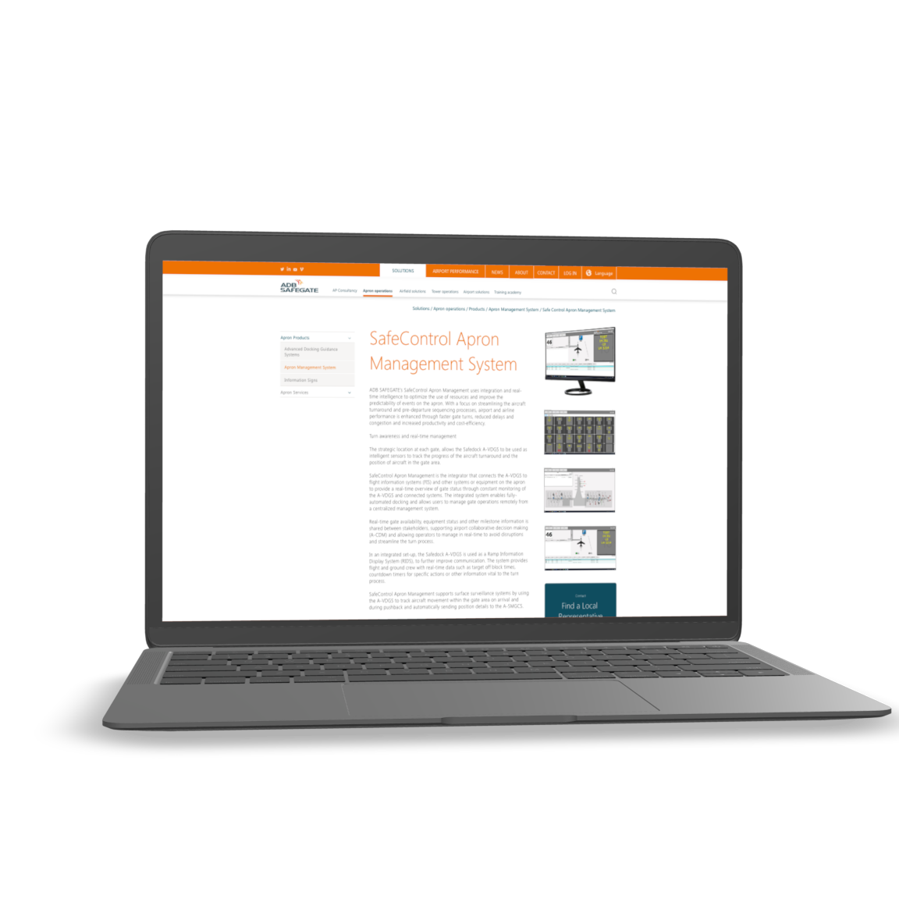
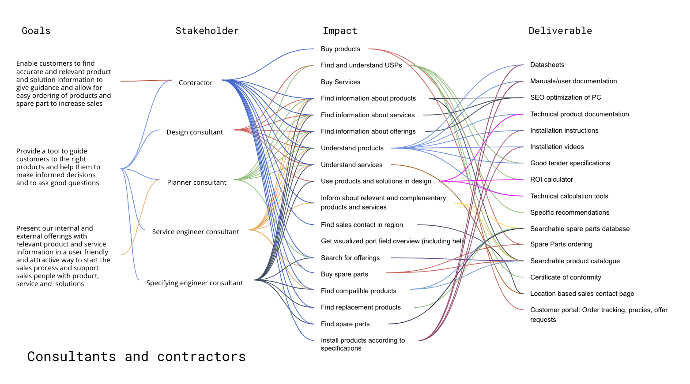
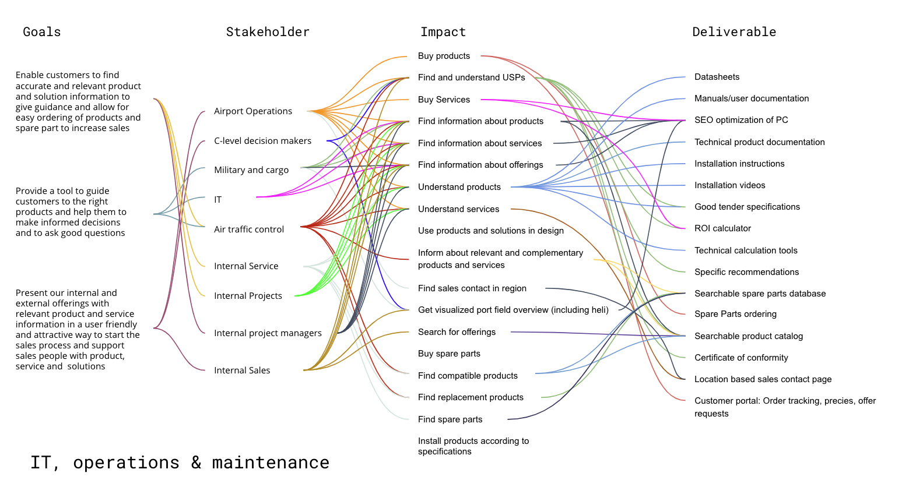

# Next step aviation

ADB safe gate is a global provider of integrated service and products for setting up and maintaining Airports. 
We worked together on multiple initiatives where I consulted on design and communication strategies and developed roadmaps for initiative rollouts.  I also worked on re-designs of their web platform improving user flows and on-site navigations.    

Some of the outcomes from our strategic work was the mapping of the web platform highlighting web goals and relating them to the diverse group of 15 stakeholder groups. We also helped to build consensus across management identifying areas of improvements and suggested solutions for front and back-end. 
Additionally, we also worked on structuring the ADB safegate portfolio and improve customer-centric communication.

