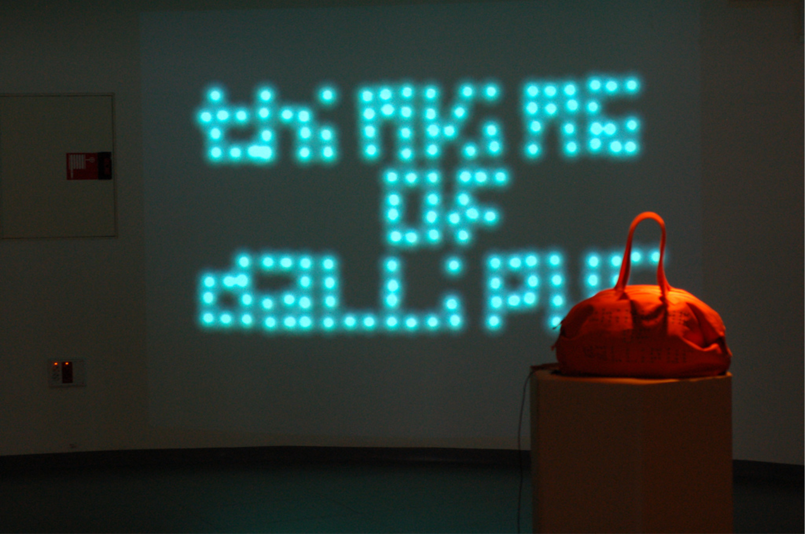
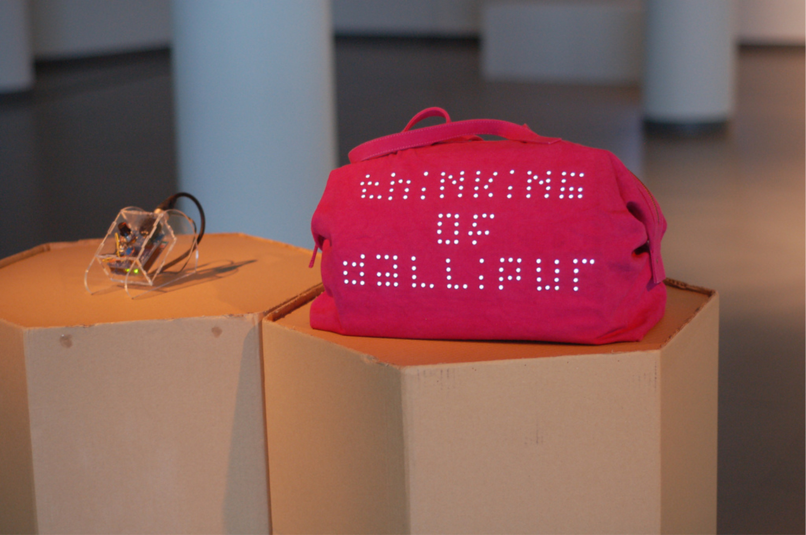
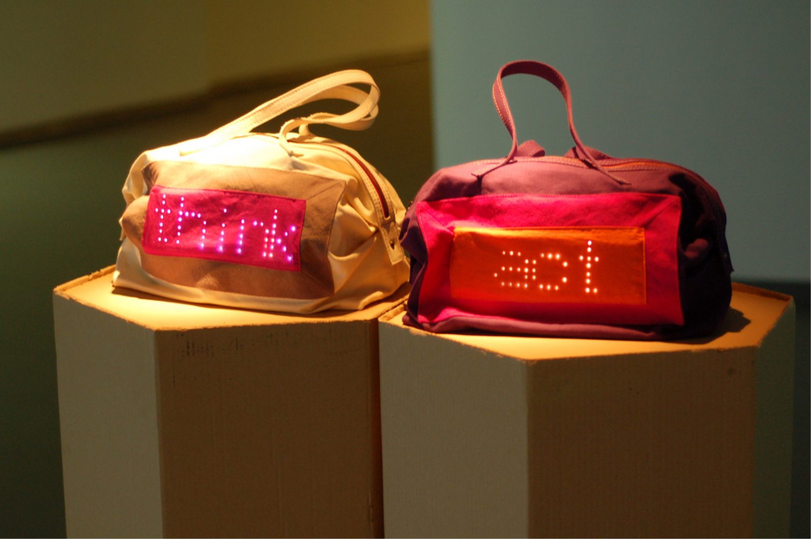
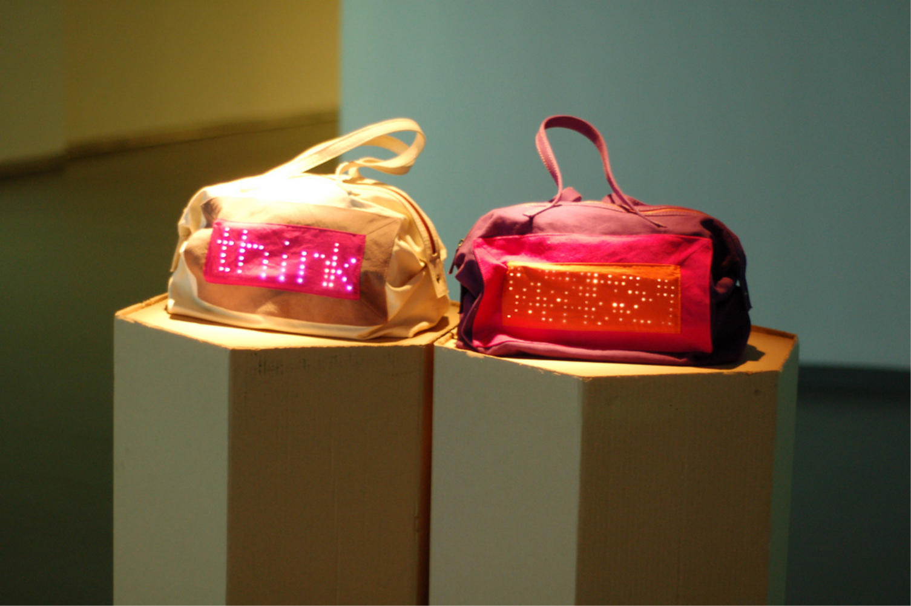

### Picasso had his pink period and his blue period. I am in my blonde period right now.

When I first started wearing pink, it wasn't nothing I planned on doing or strategized. But people showed me so much love for the pink mink I wore, I had to go out to Pantone and create my own color, which is called Killa Pink.

<iframe width="560" height="315" src="https://www.youtube.com/embed/Tzfo7mQc5iM" frameborder="0" allow="accelerometer; autoplay; clipboard-write; encrypted-media; gyroscope; picture-in-picture" allowfullscreen></iframe>

