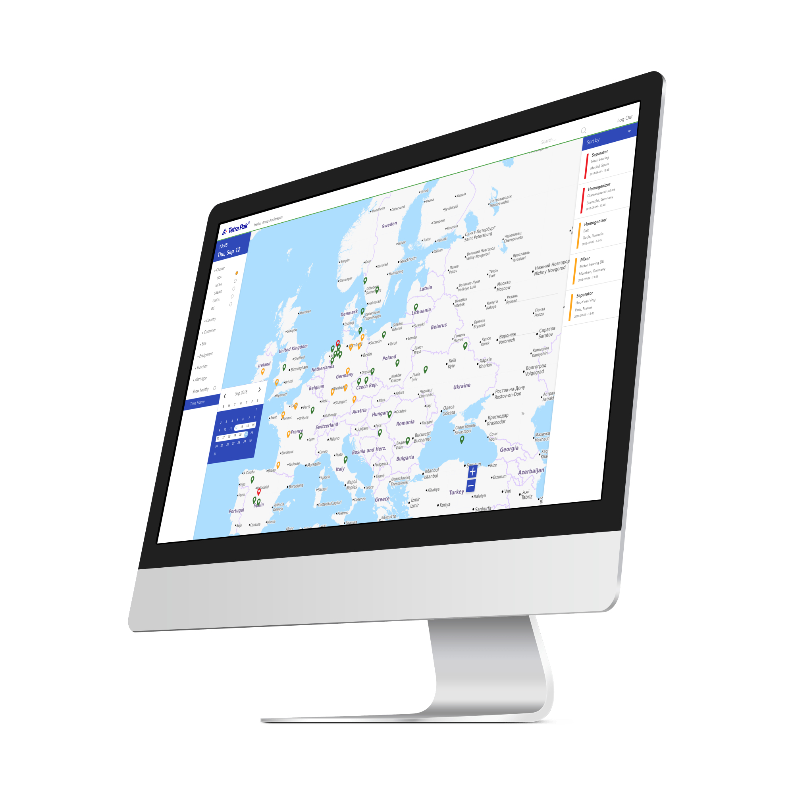
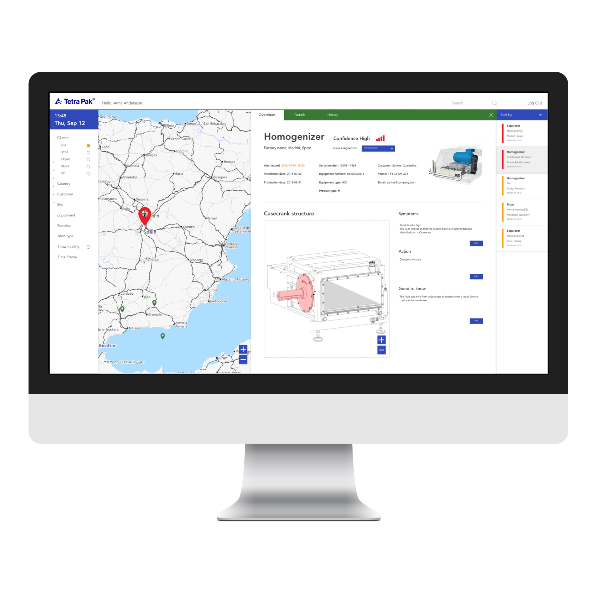
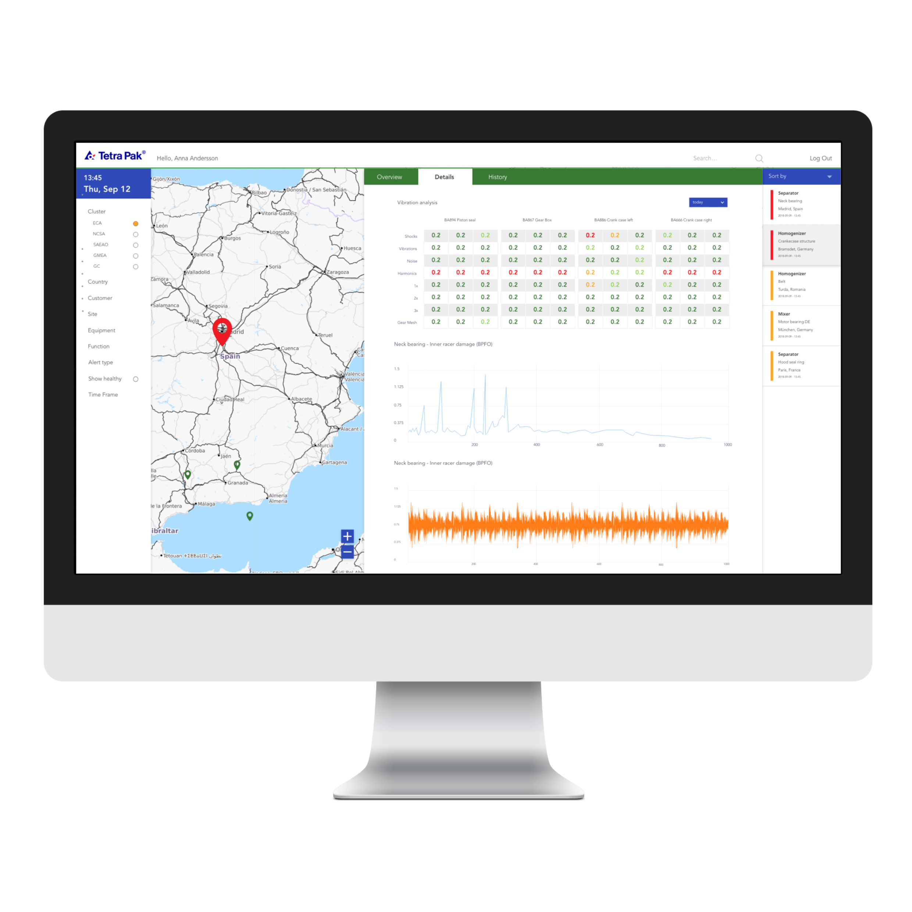

# Designing what is good

Tetra Pak is one of the world's largest manufacturer of processing and packaging solutions for food. I was apart of a pilot project working with data analytics and visualisation primarily towards internal stakeholders in Predictive Maintenance and Condition Monitoring. 
The group are tasked with real-time monitoring of critical equipment parts. Predictive Maintenance identifies deviations in machine functions that could lead to performance issues or machine breakdowns. 
They offer Predictive Maintenance service taking full responsibility for equipment set-up, data analysis and maintenance. 

I started my work at Tetra Pak as designer and sprint facilitator following the google venture model on multiple initiatives. For the predictive maintenance initiative, I helped to set up the design strategy and map the user needs. Once the project had been green-lighted I was invited back as lead designer for creating the visualisation of data flows and creation of dashboards. The project was later scaled up to SAFE according to scrum where I was added as lead designer to an additional team. During my time with Tetra Pak, I also worked on developing custom visualization and dashboards for selected clients.

